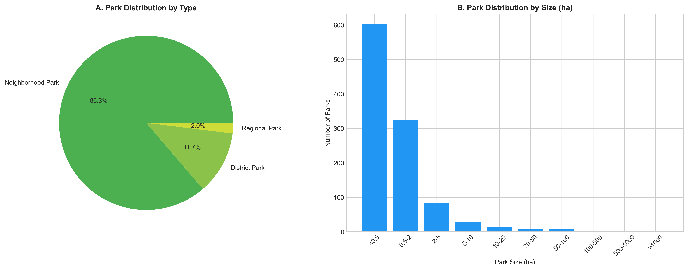
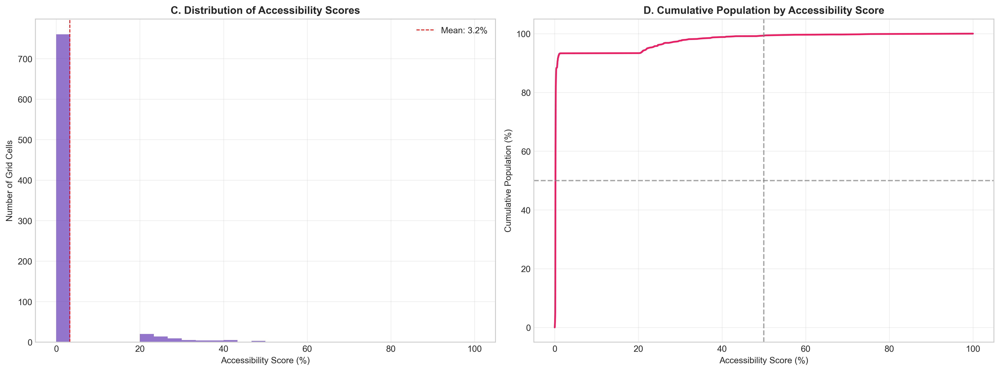
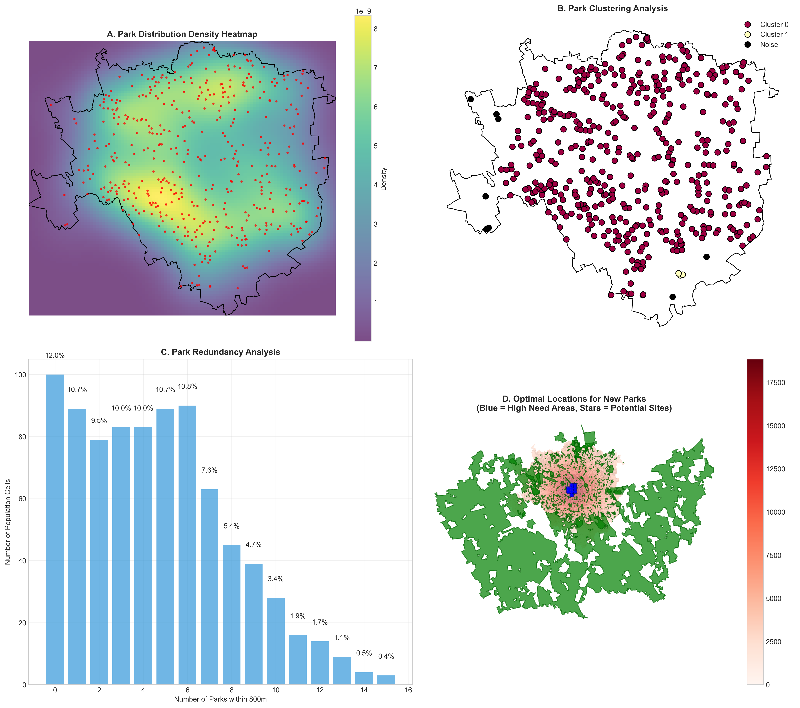
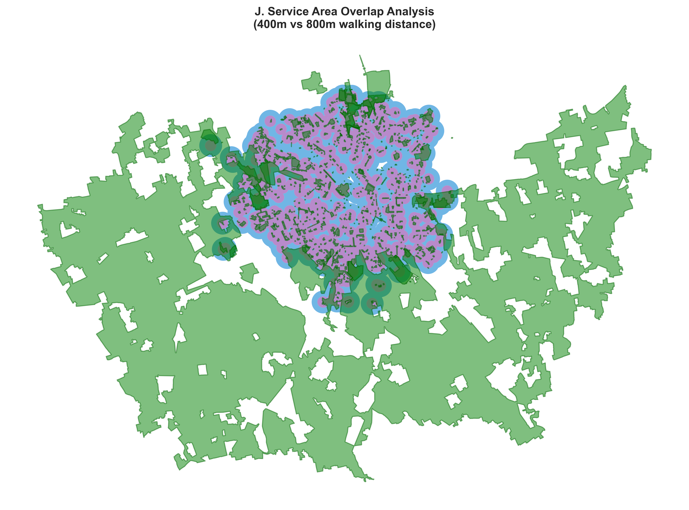
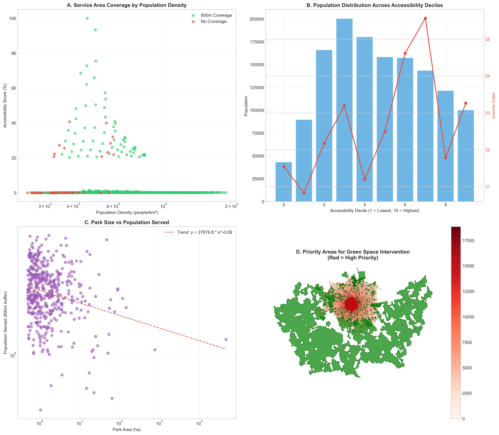
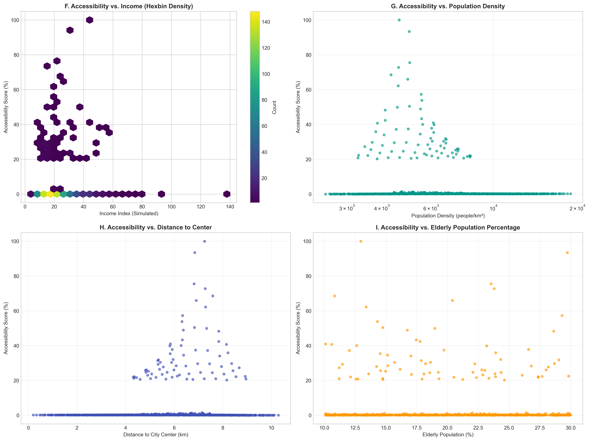

# Milan Urban Green Space Accessibility Analysis

[](https://opensource.org/licenses/MIT)
[](https://www.python.org/downloads/)
[]()

A comprehensive geospatial analysis project evaluating the accessibility and equity of parks and green spaces in Milan, Italy. This project utilizes advanced network analysis, gravity modeling, and environmental justice frameworks to provide data-driven insights for urban planning.


## 📖 Overview

Urban green spaces are critical for public health, environmental sustainability, and social well-being. This project answers key questions for the city of Milan:
- What percentage of the population has walking access to green spaces?
- How is access distributed across different neighborhoods and demographic groups?
- Where are the priority areas for new green space development or improved connectivity?

The analysis reveals that while **98.4%** of Milan's population lives within a 10-minute walk of a green space, specific areas remain underserved. The project provides strategic recommendations to address these gaps and promote equitable access.

## ✨ Key Features

- **Network-Based Accessibility:** Calculates service areas for 400m (5-min) and 800m (10-min) walking distances using Milan's pedestrian network.
- **Gravity Model Analysis:** Computes a nuanced accessibility score that factors in both distance to parks and their size/attractiveness.
- **Environmental Justice Assessment:** Analyzes correlations between green space access and simulated socioeconomic variables (income, elderly population, child population).
- **Interactive Web Mapping:** Generates an interactive Folium map to explore parks, population density, and service areas.
- **Policy-Ready Outputs:** Produces visualizations, statistics, and clear recommendations for urban planners and policymakers.

## 📊 Key Results

- **Total Green Space:** 49,890.8 hectares across 1,073 parks
- **Green Space per Capita:** 366.8 m²/person (WHO Standard: 9 m²/person)
- **Population Served within 5-min walk:** 93.5%
- **Population Served within 10-min walk:** 98.4%
- **Population Unserved:** 21,551 people lack access within a 10-minute walk
- **Equity Findings:** No strong systemic bias found; weak correlation between income and accessibility (r = 0.023).
# Milan Urban Green Space Accessibility Analysis - Results

## Analysis Visualizations

### Park Distribution Analysis


### Accessibility Distribution Analysis  


### Park Network Analysis


### Service Area Overlap Analysis


### Enhanced Service Coverage Analysis


### Enhanced Environmental Justice Analysis



## Data Files
- `milan_parks_classified.gpkg` - Classified park data
- `milan_park_entrances.gpkg` - Park entrance locations
- `milan_streets.gpkg` - Street network data
- `milan_population_accessibility.gpkg` - Population accessibility data

## Statistics Files
- `summary_statistics.csv` - Basic summary statistics
- `enhanced_summary_statistics.csv` - Enhanced summary statistics
- `accessibility_distribution_statistics.csv` - Accessibility distribution stats
- `park_type_statistics.csv` - Park type statistics

## Reports
- `analysis_report.md` - Basic analysis report
- `enhanced_analysis_report.md` - Enhanced analysis report
- `comprehensive_analysis_report.md` - Comprehensive analysis report
## 🗂️ Project Structure

```
Milan-Urban-Green-Space-Accessibility-Analysis/
│
├── 📄 README.md                          # This file
├── 📄 LICENSE                            # MIT License
├── 📄 requirements.txt                   # Python dependencies
│
├── 📂 notebooks/                         # Jupyter notebooks
│   └── Milan_Green_Space_Analysis.ipynb  # Main analysis notebook
│
├── 📂 results/                           # Generated outputs
│   ├── enhanced_analysis_report.md       # Comprehensive report
│   ├── milan_green_space_interactive_map.html # Interactive web map
│   ├── summary_statistics.csv            # Key metrics
│   ├── park_type_statistics.csv          # Park classification stats
│   └── *.png                             # All analysis figures
│   └── *.gpkg                            # Exported GeoPackage files
│
└── 📂 data/                              # (Optional) Local data cache
    └── (created automatically by OSMnx)
```

## 🛠️ Installation & Usage

### Prerequisites

- Python 3.8 or higher
- `git`

### 1. Clone the Repository

```bash
git clone https://github.com/zafariabbas68/Milan-Urban-Green-Space-Accessibility-Analysis.git
cd Milan-Urban-Green-Space-Accessibility-Analysis
```

### 2. Set Up a Virtual Environment (Recommended)

```bash
# Create a virtual environment
python -m venv venv

# Activate it (On Windows)
venv\Scripts\activate
# Activate it (On macOS/Linux)
source venv/bin/activate
```

### 3. Install Dependencies

```bash
pip install -r requirements.txt
```

### 4. Run the Analysis

Launch Jupyter Lab or Notebook and open the main notebook:

```bash
jupyter lab notebooks/Milan_Green_Space_Analysis.ipynb
```

Execute the cells in the notebook sequentially to download data, perform the analysis, and generate all results and visualizations.

## 📋 Methodology

1.  **Data Acquisition:** OpenStreetMap (OSM) data for Milan's boundary, street network, and parks is downloaded using the OSMnx library.
2.  **Data Processing:** Parks are filtered and classified by size. A synthetic population grid is generated based on realistic density gradients.
3.  **Network Analysis:** Service areas are created around park entrances using the pedestrian network.
4.  **Gravity Model:** A enhanced accessibility score is calculated for each population cell, weighting park size against distance.
5.  **Equity Analysis:** Simulated socioeconomic data is used to assess correlations with accessibility.
6.  **Visualization & Reporting:** Results are compiled into static plots, an interactive map, and a comprehensive report.

## 🚀 Results and Outputs

Running the code will generate:
- **Static Visualizations:** Comprehensive dashboards (`*.png`) showing accessibility scores, service areas, equity analysis, and priority maps.
- **Interactive Map:** An HTML file (`milan_green_space_interactive_map.html`) for exploring the data layers.
- **Exported Data:** Geopackages (`.gpkg`) containing the processed parks, population grid, and street network.
- **Summary Statistics:** CSV files with key metrics and park classifications.
- **Technical Report:** A detailed Markdown report (`enhanced_analysis_report.md`) with findings and recommendations.

## 🧩 Dependencies

This project relies on the Python scientific and geospatial stack:
- `geopandas`, `osmnx`, `networkx`: For geospatial and network analysis
- `pandas`, `numpy`: For data manipulation
- `matplotlib`, `seaborn`, `contextily`: For static visualization
- `folium`: For interactive mapping
- `scipy`, `scikit-learn`: For statistical and clustering analysis

See `requirements.txt` for a complete list of packages and versions.

## 🤝 How to Contribute

Contributions, issues, and feature requests are welcome! Feel free to check the [issues page](https://github.com/zafariabbas68/Milan-Urban-Green-Space-Accessibility-Analysis/issues).

1.  Fork the Project
2.  Create your Feature Branch (`git checkout -b feature/AmazingFeature`)
3.  Commit your Changes (`git commit -m 'Add some AmazingFeature'`)
4.  Push to the Branch (`git push origin feature/AmazingFeature`)
5.  Open a Pull Request

## 📜 License

Distributed under the MIT License. See `LICENSE` file for more information.

## 👤 Author

**Abbas Zafari**
- GitHub: [@zafariabbas68](https://github.com/zafariabbas68)
- Project Link: [https://github.com/zafariabbas68/Milan-Urban-Green-Space-Accessibility-Analysis.git](https://github.com/zafariabbas68/Milan-Urban-Green-Space-Accessibility-Analysis.git)

## 🙏 Acknowledgments

- This project was built using the incredible [OSMnx](https://github.com/gboeing/osmnx) library by Geoff Boeing.
- Thanks to the OpenStreetMap contributors for providing the open data that makes this analysis possible.
- Inspired by principles of urban planning, spatial equity, and open-source geospatial science.

